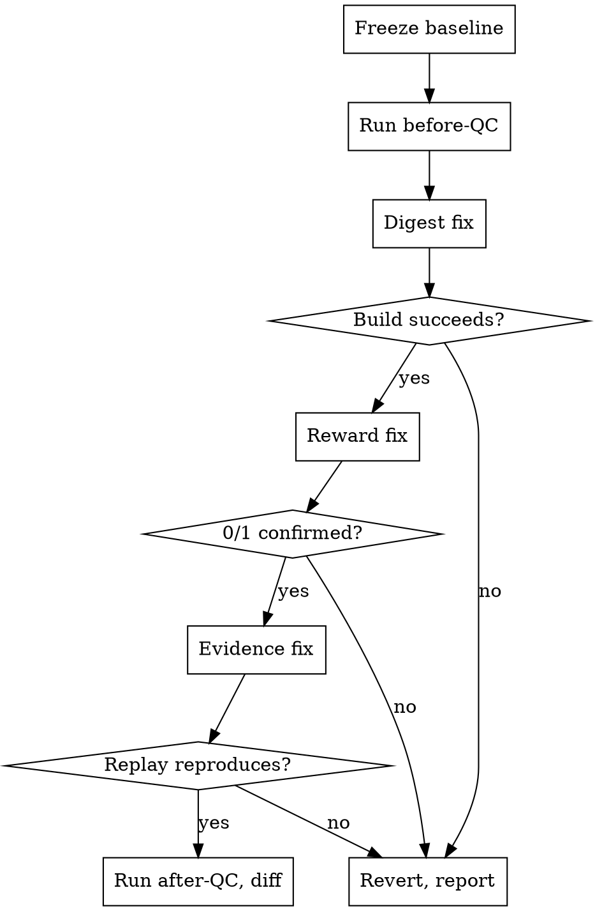

# Harbor Task Repair

## Overview

Repair Harbor task packages that fail client QC, without fabricating evidence.

**Core principle: a fix is not done until a tool that did not make the change confirms it.** Every repair either passes an objective check (image builds, verifier emits 0/1, checker status flips) or it gets reverted. No fix is justified by argument alone.

Five failure families account for nearly all mechanically-repairable findings. Each has a known fix and a known verification.

## When to Use

- Client QC reports `image_reference_immutability`, `binary_final_reward_contract`, `layer2_solvability`, `layer2_stability`, `evidence_pairing_count`, or `environment_interaction` failures
- `docker build` fails on a delivered task package
- A package ships stability evidence frozen from the Oracle rather than a model
- Tasks must be repaired in bulk with a defensible change record

**Do NOT use for:** authoring new verifier checks, rewriting task instructions, or any change requiring judgement about what a task *should* assert.

The boundary is **whether an objective check can settle it.** A digest either builds or it doesn't; a reward either reads 0/1 or it doesn't. "Does this memo assertion check the right thing?" has no such test — it needs someone who knows the task's intent. Repairing that class by pattern-matching produces plausible edits nobody can verify, which is worse than leaving the finding open.

**In scope** (mechanical, verifiable): documentation that cites a path or figure which is now wrong — repointing `README.md` / `review.csv` after an evidence change is part of that fix, not separate authoring work.

**Out of scope** (needs intent): `coverage_depth`, `surface_form_brittleness`, new assertions, rewritten instructions, connector interface redesign. Report these with the reviewer's own words and hand them to a human.

## The Iron Law

```
NO REPAIR WITHOUT A FROZEN BASELINE AND AN INDEPENDENT VERIFICATION
```

Before touching anything: copy the packages to `baseline/`, hash every file, `chmod -R a-w`. Every edit happens in `work/`. If a verification fails, restore from `baseline/` — do not adjust the fix until the number looks right.

**No exceptions:**
- Don't mark a finding closed because the code "clearly" does the right thing now
- Don't rewrite a declared hash to match a file — that makes the check pass and proves nothing
- Don't write stability evidence unless a replay reproduced the original reward exactly
- Don't edit QC provenance records (`client_qc*`) to match a new reality

## Quick Reference

| Finding | Fix | Verification |
|---|---|---|
| Doubled digest `@sha256:X@sha256:Y` | keep only the final `@sha256:` | build succeeds **and** the kept digest matches the package's own receipt |
| Fractional final reward | binarize at the write site | golden→`1`, broken→`0` in the real image |
| Solvability from Oracle | attach a passing model run from `difficulty/` | `solvability_qc_status: pass` |
| Stability frozen from Oracle | replay a model trajectory, re-grade 3–5× | replay reproduces original reward exactly |
| Duplicate evaluation battery | delete the orphan, repoint the docs | `evidence_pairing_count` clears in full QC |

## Workflow



Order matters: the digest fix must land first because every later verification needs a buildable image.

## Every Fix Has Four Parts

A fix is not one edit. It is four, in order, and it is unfinished until all four are done:

1. **The change** — the edit that removes the defect
2. **The mirror** — if the Dockerfile bakes a copy (`COPY _app/... /app/tests/`), sync it, or the change is inert at runtime
3. **The declarations** — every file that *describes* what you just changed
4. **The proof** — an objective check run by something that did not make the change

Part 3 is the one that gets dropped. Changing a verifier, a reward writer, or an evidence directory falsifies whatever described the old behaviour:

| Changed | Now possibly false |
|---|---|
| reward writer | `test.sh` header comments, module docstrings, README scoring text |
| `verifier.json` / check set | README check counts, `review.csv` cells citing them |
| evidence directory | README battery paths and figures, `review.csv` citations |
| stability evidence | any text calling the repeats "oracle re-grades" |

**Grep the package for the thing you changed** — the old path, the old count, the old wording — and reconcile every hit. A repaired package whose README describes the unrepaired one is a new defect you introduced, and only a full QC run will catch it.

Never edit `client_qc*`. Those record what QC observed; append a dated amendment instead.

## Scan, Don't Read the Findings List

Start from a direct scan of every package for every defect class. The QC findings list tells you what a reviewer happened to catch on the runs it happened to see — it is a starting point, not an inventory.

Observed both ways in real runs: a package with a fractional reward that the before-run never flagged, and ten packages never flagged because a detector signal was a false positive. Both would have shipped unrepaired if the findings list were trusted.

Grep the write site, the `FROM` line, the evaluation axes on **every** package, then reconcile that against the findings list. Where they disagree, the scan is usually right and always worth checking.

## Triage Before You Repair

Two classes of finding are **not defects** and must not be repaired. Repairing them wastes effort and, in the difficulty case, damages evidence.

**Strict-pass count of 3/4.** The client accepts a 3-of-4 pass rate through manual QC. A task failing *solely* because `difficulty_strict_passes` is 3 is not a blocker — do not re-run batteries, delete runs, or otherwise manufacture a 2/4. Triage the task's *other* findings normally. Across one 232-package scan, 78 of 101 "failures" were solely this, so treating it as a defect misstates the real blocker count by a factor of four.

**Lane and credential failures.** `environment_interaction`, `agent_tool_schema_compatibility`, `artifact_integrity`, `connector_interaction` arising from a missing or invalid model endpoint are infrastructure artifacts. The tell: the finding itself reports the environment as healthy — *"the sandbox, image build and install themselves worked"*, *"gym seeded and 14 tools ready"* — and the agent produced zero turns. Label `lane unavailable`; never count as package defects or regressions.

## The Five Fixes

### 1. Doubled digest

```
FROM python:3.12-slim-bookworm@sha256:782412e8…@sha256:a116514e…
```

Two digests on one reference. Docker rejects it, so the image never builds, and that single defect cascades into Layer 3 oracle failure, Layer 4 environment failure, and Layer 5 calibration failure.

**Keep the FINAL digest.** Evidence for this: the package's own `client_qc/access-receipt.json` names the second digest; the first is an identical injected prefix across affected packages; the second matches what healthy packages use alone.

`scripts/fix_digest.py` — rewrites on raw bytes, one substitution per file, asserts a single match.

**A green build does NOT confirm the digest choice.** Both digests are real and both
build. Keeping the wrong one silently swaps the base image and the oracle still passes.
Confirm the choice against the package's own evidence — `client_qc/access-receipt.json`,
`README.md`, or `task.toml` naming the intended base — before accepting the build as proof.

**Also check `environment/_app/`.** If the Dockerfile does `COPY _app/tests/ /app/tests/`, the image runs the mirror, not `tests/`. Editing `tests/` alone is inert. Run the package's `sync_app_mirror.sh` and rebuild.

### 2. Fractional reward

The contract: *final reward range is exactly {0, 1}*. Criterion-level scores may stay fractional — only the final value Harbor reads must be binary, and Harbor reads `reward.txt` first then `reward.json`, so both must change together.

Binarize at the write site: `1` if and only if the value is a complete pass with no gate applied, else `0`. Never round up — `0.999` is a `0`.

Leave `reward_detail.json` and `verifier_summary.json` fractional.

**Verify in the real image:** golden solution must emit exactly `1`; delete a required deliverable and it must emit exactly `0`.

### 3. Solvability from Oracle

`evaluations/solvability/r1` with `agent=oracle` and no trajectory fails, because the check wants proof a *model* solved it.

The proof is usually already in the package — a `difficulty/rN` run at reward 1.0 with a trajectory. Copy it in verbatim as a new `solvability/rN`, leave the oracle run in place, and write `ATTACHED_FROM.json` recording source, both SHA-256s, and `"regraded": false`.

`scripts/fix_solvability.py` — mirrors the checker's own eligibility test.

### 4. Stability frozen from Oracle

`frozen_source: "Frozen Oracle replay and materialized artifacts."` and no `agent/frozen_trajectory.json`.

An oracle replay has no trajectory, so there is nothing to freeze and nothing on disk can match the declared hash. This is not a lost file — it is the wrong kind of run.

Fix requires real execution: rebuild the model run's workspace by replaying its own tool calls, confirm it grades to the **same reward the original recorded**, then freeze and re-grade 3–5 times.

`scripts/replay_regrade.py` — refuses to freeze on a reward mismatch. That refusal is the feature.

**Run the verifier phase as root (`docker exec -u 0`).** Images ending `USER <non-root>` cannot create `/logs`, so `test.sh` never writes `reward.txt` and the empty read looks exactly like a reward mismatch. Harbor runs the verifier as root.

### 5. Duplicate evaluation battery

Two batteries (`evaluations/difficulty/` and e.g. `evaluations/glm-5.2/`) means the AI reviewer sees more attempts than the framework allows. Note the programmatic checker only globs `difficulty/`, so **this finding cannot be reproduced or verified with `audit_evaluations.py`** — only a full QC run shows it.

Delete the orphan, repoint `README.md` and `review.csv` at the surviving battery. Amend provenance files additively (append a dated note); never rewrite what QC recorded.

## Change Ledger

Every change gets a record before moving on. `scripts/ledger.py`:

```bash
python3 ledger.py add --step A1-digest --task NAME --file environment/Dockerfile \
  --action rewrite-line --before "<old>" --after "<new>" \
  --rationale "<why>" --agent digest-fixer --path /abs/path
# prints seq N
python3 ledger.py verify --seq N --verified-by "docker build succeeded"
```

Records carry `sha256_before/after`, `reversible`, and `verified_by`. A record without `verified_by` is an unfinished fix. `decisions.json` holds every judgement call with its evidence and who approved it.

## Multi-Agent Split

| Agent | Owns | Never touches |
|---|---|---|
| `digest-fixer` | `environment/` | `tests/`, `evaluations/` |
| `reward-fixer` | `tests/` | `environment/`, `evaluations/` |
| `evidence-hygienist` | `evaluations/`, docs | `environment/`, `tests/` |
| `verifier` | nothing — runs checks only | everything |

**Serialise ledger writes.** `changes.json` is read-modify-write; two agents appending concurrently will lose a record.

**The verifier agent never edits.** A fix confirmed only by its author is not confirmed.

## Common Mistakes

| Mistake | Consequence |
|---|---|
| Running a verifier without `[verifier.env]` from `task.toml` | Judge tasks hit their infra guard and write NO reward; reads as a false "no reward" |
| Trusting `echo 0 > reward.txt` in `test.sh` as proof of binarity | It is often a *floor* seeded before the real writer; check both ends instead |
| Accepting empty-workspace `0` as full proof | A floor zero looks identical; only golden=`1` exercises the other end |
| Editing `tests/` when the Dockerfile bakes `_app/tests/` | Fix is inert at runtime; source and image disagree |
| `Path.write_text` on a CRLF file | Hundreds of phantom line changes; restore from baseline and rewrite on bytes |
| `docker exec` without `-u 0` for the verifier | Empty `reward.txt` misread as a reward mismatch |
| Copying one example digest across files | Each package has its own second digest |
| Rewriting a declared hash to match a file | Check passes, evidence proves nothing |
| Expecting `audit_evaluations.py` to show the battery fix | It never globbed the orphan directory |
| Counting distinct criteria and raw findings in one table | Numbers that don't reconcile |
| Fixing behaviour without reconciling what describes it | README/`test.sh` header/docstring now lies; only a full QC run catches it |
| Reading Layer 4/5 findings without checking lane health | You report harness failures as package defects |
| Treating a connector task's absent reward as a defect | It has no gym in a bare container; nothing was gradable |

## Measuring Before/After

Run full QC before and after, then diff **raw finding counts** per area — not sets of criteria, which dedupe and won't reconcile with totals.

`scripts/qc_delta.py` — reports per-task, per-area counts and flags tasks missing an after-report.

**A task that produced no after-report is not a pass.** Report it separately; a blocked pipeline is not a clean package.

Expect lane-credential failures (`environment_interaction`, `artifact_integrity`, `connector_interaction`) when a model endpoint is missing. Those are infrastructure artifacts, not package defects — label them `lane unavailable` rather than counting them as regressions.

**Assert lane health before reading any Layer 4 or 5 finding.** A lane that scored 0.0 on every task in the run is dead, and every finding downstream of it describes your harness, not the packages. Check per-lane reward spread first: all-zero across every task means stop and fix credentials, because those findings carry no information about package quality.

## Known Gaps

State these rather than working around them.

**Connector tasks cannot be verified by this skill.** A connector package needs its MCP proxy and a seeded gym; a bare container gives the verifier nothing to grade, so the reward is absent or meaningless. `reward.txt` emitting nothing on a connector task is expected, not a defect. Verifying one properly needs a Harbor oracle run with the gym up — out of scope here. Report connector packages as unverified rather than guessing from a bare-container result.

**Vendor-origin evidence cannot be reconstructed.** Replay-derived stability evidence is genuine execution but does not originate from the original vendor run, and the packages retain no workspace artifacts (`artifacts/manifest.json` reads `status: "empty"`) to make that possible. If the client requires vendor-origin evidence, say so plainly — it cannot be produced.
