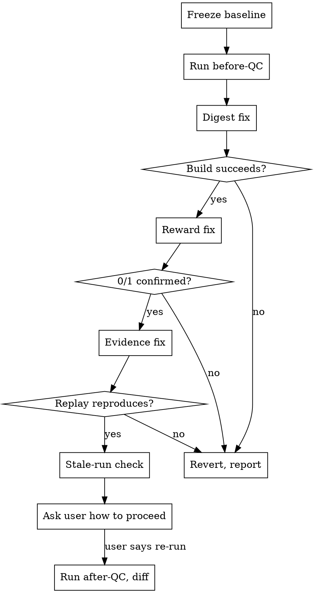

# Harbor Task Repair

## Overview

Repair Harbor task packages that fail client QC, without fabricating evidence.

**Core principle: a fix is not done until a tool that did not make the change confirms it.** Every repair either passes an objective check (image builds, verifier emits 0/1, checker status flips) or it gets reverted. No fix is justified by argument alone.

Five failure families account for nearly all mechanically-repairable findings. Each has a known fix and a known verification.

## When to Use

- Client QC reports `image_reference_immutability`, `binary_final_reward_contract`, `layer2_solvability`, `layer2_stability`, `evidence_pairing_count`, or `environment_interaction` failures
- `docker build` fails on a delivered task package
- A package ships stability evidence frozen from the Oracle rather than a model
- Tasks must be repaired in bulk with a defensible change record

**Do NOT use for:** authoring new verifier checks, rewriting task instructions, or any change requiring judgement about what a task *should* assert.

The boundary is **whether an objective check can settle it.** A digest either builds or it doesn't; a reward either reads 0/1 or it doesn't. "Does this memo assertion check the right thing?" has no such test — it needs someone who knows the task's intent. Repairing that class by pattern-matching produces plausible edits nobody can verify, which is worse than leaving the finding open.

**In scope** (mechanical, verifiable): documentation that cites a path or figure which is now wrong — repointing `README.md` / `review.csv` after an evidence change is part of that fix, not separate authoring work.

**Out of scope** (needs intent): `coverage_depth`, `surface_form_brittleness`, new assertions, rewritten instructions, connector interface redesign. Report these with the reviewer's own words and hand them to a human.

## The Iron Law

```
NO REPAIR WITHOUT A FROZEN BASELINE AND AN INDEPENDENT VERIFICATION
```

Before touching anything: copy the packages to `baseline/`, hash every file, `chmod -R a-w`. Every edit happens in `work/`. If a verification fails, restore from `baseline/` — do not adjust the fix until the number looks right.

**No exceptions:**
- Don't mark a finding closed because the code "clearly" does the right thing now
- Don't rewrite a declared hash to match a file — that makes the check pass and proves nothing
- Don't write stability evidence unless a replay reproduced the original reward exactly
- Don't edit QC provenance records (`client_qc*`) to match a new reality
- Don't change a recorded verdict. Binarizing a recorded fractional reward is required (see [fix 2](#2-fractional-reward)); turning a `0.999` into a `1`, or binarizing the evidence without fixing the code that wrote it, is tampering
- Don't re-run QC or any battery on your own because a run went stale. Detect it, tell the user which tasks, and ask (see [Stale runs](#stale-runs-detect-notify-ask))

## Quick Reference

| Finding | Fix | Verification |
|---|---|---|
| Doubled digest `@sha256:X@sha256:Y` | keep only the final `@sha256:` | build succeeds **and** the kept digest matches the package's own receipt |
| Fractional final reward | binarize at the write site, then project recorded evidence (`reward_raw.txt` keeps the native value) | golden→`1`, broken→`0` in the real image |
| Solvability from Oracle | attach a passing model run from `difficulty/` | `solvability_qc_status: pass` |
| Stability frozen from Oracle | replay a model trajectory, re-grade 3–5× | replay reproduces original reward exactly |
| Duplicate evaluation battery | delete the orphan, repoint the docs | `evidence_pairing_count` clears in full QC |

## Workflow


```dot
digraph repair {
    "Freeze baseline" [shape=box];
    "Run before-QC" [shape=box];
    "Digest fix" [shape=box];
    "Build succeeds?" [shape=diamond];
    "Reward fix" [shape=box];
    "0/1 confirmed?" [shape=diamond];
    "Evidence fix" [shape=box];
    "Replay reproduces?" [shape=diamond];
    "Stale-run check" [shape=box];
    "Ask user how to proceed" [shape=box];
    "Run after-QC, diff" [shape=box];
    "Revert, report" [shape=box];

    "Freeze baseline" -> "Run before-QC" -> "Digest fix" -> "Build succeeds?";
    "Build succeeds?" -> "Reward fix" [label="yes"];
    "Build succeeds?" -> "Revert, report" [label="no"];
    "Reward fix" -> "0/1 confirmed?";
    "0/1 confirmed?" -> "Evidence fix" [label="yes"];
    "0/1 confirmed?" -> "Revert, report" [label="no"];
    "Evidence fix" -> "Replay reproduces?";
    "Replay reproduces?" -> "Stale-run check" [label="yes"];
    "Replay reproduces?" -> "Revert, report" [label="no"];
    "Stale-run check" -> "Ask user how to proceed";
    "Ask user how to proceed" -> "Run after-QC, diff" [label="user says re-run"];
}
```

Order matters: the digest fix must land first because every later verification needs a buildable image.

## Every Fix Has Four Parts

A fix is not one edit. It is four, in order, and it is unfinished until all four are done:

1. **The change** — the edit that removes the defect
2. **The mirror** — if the Dockerfile bakes a copy (`COPY _app/... /app/tests/`), sync it, or the change is inert at runtime
3. **The declarations** — every file that *describes* what you just changed
4. **The proof** — an objective check run by something that did not make the change

Part 3 is the one that gets dropped. Changing a verifier, a reward writer, or an evidence directory falsifies whatever described the old behaviour:

| Changed | Now possibly false |
|---|---|
| reward writer | `test.sh` header comments, module docstrings, README scoring text |
| `verifier.json` / check set | README check counts, `review.csv` cells citing them |
| evidence directory | README battery paths and figures, `review.csv` citations |
| stability evidence | any text calling the repeats "oracle re-grades" |

**Grep the package for the thing you changed** — the old path, the old count, the old wording — and reconcile every hit. A repaired package whose README describes the unrepaired one is a new defect you introduced, and only a full QC run will catch it.

Never edit `client_qc*`. Those record what QC observed; append a dated amendment instead.

## Scan, Don't Read the Findings List

Start from a direct scan of every package for every defect class. The QC findings list tells you what a reviewer happened to catch on the runs it happened to see — it is a starting point, not an inventory.

Observed both ways in real runs: a package with a fractional reward that the before-run never flagged, and ten packages never flagged because a detector signal was a false positive. Both would have shipped unrepaired if the findings list were trusted.

Grep the write site, the `FROM` line, the evaluation axes on **every** package, then reconcile that against the findings list. Where they disagree, the scan is usually right and always worth checking.

## Triage Before You Repair

Two classes of finding are **not defects** and must not be repaired. Repairing them wastes effort and, in the difficulty case, damages evidence.

**Strict-pass count of 3/4.** The client accepts a 3-of-4 pass rate through manual QC. A task failing *solely* because `difficulty_strict_passes` is 3 is not a blocker — do not re-run batteries, delete runs, or otherwise manufacture a 2/4. Triage the task's *other* findings normally. Across one 232-package scan, 78 of 101 "failures" were solely this, so treating it as a defect misstates the real blocker count by a factor of four.

**Lane and credential failures.** `environment_interaction`, `agent_tool_schema_compatibility`, `artifact_integrity`, `connector_interaction` arising from a missing or invalid model endpoint are infrastructure artifacts. The tell: the finding itself reports the environment as healthy — *"the sandbox, image build and install themselves worked"*, *"gym seeded and 14 tools ready"* — and the agent produced zero turns. Label `lane unavailable`; never count as package defects or regressions.

## The Five Fixes

### 1. Doubled digest

```
FROM python:3.12-slim-bookworm@sha256:782412e8…@sha256:a116514e…
```

Two digests on one reference. Docker rejects it, so the image never builds, and that single defect cascades into Layer 3 oracle failure, Layer 4 environment failure, and Layer 5 calibration failure.

**Keep the FINAL digest.** Evidence for this: the package's own `client_qc/access-receipt.json` names the second digest; the first is an identical injected prefix across affected packages; the second matches what healthy packages use alone.

`scripts/fix_digest.py` — scans `environment/**/Dockerfile*`, compose files (`docker-compose*.yml|yaml`, `compose*.yml|yaml`) and `task.toml`; collapses two or more repeated digests to the reference plus the LAST digest, keeping any tag; rewrites on raw bytes so CRLF survives; refuses if more than one digest would remain. Dry run unless `--apply`.

Do not use infra's `qc/client_feedback_fix.py` for this: it keeps the FIRST digest, the opposite of this rule.

**A green build does NOT confirm the digest choice.** Both digests are real and both
build. Keeping the wrong one silently swaps the base image and the oracle still passes.
Confirm the choice against the package's own evidence — `client_qc/access-receipt.json`,
`README.md`, or `task.toml` naming the intended base — before accepting the build as proof.

**Also check `environment/_app/`.** If the Dockerfile does `COPY _app/tests/ /app/tests/`, the image runs the mirror, not `tests/`. Editing `tests/` alone is inert. Run the package's `sync_app_mirror.sh` and rebuild.

### 2. Fractional reward

The contract: *final reward range is exactly {0, 1}*. Criterion-level scores may stay fractional — only the final value Harbor reads must be binary. Harbor (0.21/0.22) reads `reward.json` FIRST, and every value in it must be a number (a string value makes Harbor reject the file); it falls back to `reward.txt` only when there is no `reward.json`. Change both writers together, and keep them agreeing.

Binarize at the write site: `1` if and only if the value is a complete pass with no gate applied, else `0`. Never round up — `0.999` is a `0`.

Leave `reward_detail.json` and `verifier_summary.json` fractional.

**Verify in the real image:** golden solution must emit exactly `1`; delete a required deliverable and it must emit exactly `0`. `scripts/verify_reward_binary.py TASK --image TAG --solution-cmd CMD --remove PATH` runs all three ends and reads both reward files the way Harbor does. `scripts/verify_reward_runtime.py WORK_DIR` runs the empty-workspace end over a whole corpus.

**Then binarize the recorded evidence. This is required, not optional.** The runs already in `evaluations/` were graded by the old writer, so they can still record a fraction, and the client's binary-reward check reads them. Convert them exactly as **binary-reward-contract** does (in the delivery pipeline that skill runs first, so a package may arrive already converted). For each run whose recorded reward is not exactly 0 or 1:

| File | Content |
|---|---|
| `verifier/reward_raw.txt` | the native value, unchanged (e.g. `0.1558`) |
| `verifier/reward.txt` | `1` only if the native value is exactly 1, else `0` |
| `verifier/reward.json` | `{"reward": <same 0/1>, "_marker": "harbor-binary-reward v1"}` |
| `result.json` | `verifier_result.rewards.reward` (and `reward`, if present) set to the same 0/1 |
| `verifier_summary.json`, `reward_detail.json`, `ctrf.json` | **unchanged** - per-check detail keeps the fraction |

Every reward source the QC compares (`result.json`, `reward.json`, `reward.txt`) then agrees, and the native score stays in `reward_raw.txt`. This is not tampering: no verdict changes. Tampering is rounding up (`0.999` to `1`), or binarizing the evidence while the verifier code still writes fractions. Record every evidence file in the ledger.

**Leave runs that already read exactly 0 or 1 byte-for-byte alone** - above all `evaluations/solvability/r1`. Stability repeats bind to a digest over r1's `result.json` bytes, so even re-serialising it breaks that binding.

**A converted run is not a score change.** If a check reports a recorded reward that differs from the per-check total, and the difference is the fraction-to-0/1 conversion, it is the contract, not a defect. Known case: in the infra shipping gate, a run whose `verifier_summary.json` still holds the fractional total with no boolean `reward.pass` is reported as a reward artifact that "holds no number" (`validate_tasks.run_reward`, which reads the summary as a third reward source). That is the binarization showing, not a defect - report it as such.

Binarizing evidence does not make a run stale (Harbor's task hash ignores `evaluations/`). Changing the verifier code in `tests/` does - see [Stale runs](#stale-runs-detect-notify-ask).

### 3. Solvability from Oracle

`evaluations/solvability/r1` with `agent=oracle` and no trajectory fails, because the check wants proof a *model* solved it.

The proof is usually already in the package — a `difficulty/rN` run at reward 1.0 with a trajectory. Copy it in verbatim as a new `solvability/rN`, leave the oracle run in place, and write `ATTACHED_FROM.json` recording source, both SHA-256s, and `"regraded": false`.

`scripts/fix_solvability.py ROOT [--apply]` — mirrors the checker's own eligibility test (`audit_evaluations.classify_result` / `solvability_qc`): recursive leaf `result.json` discovery; Oracle detected by `oracle.txt` or a name starting with `oracle` in `agent_info`, `config.agent`, `trial_name` or `model`; reward from `verifier_result.rewards.reward`, booleans rejected; frozen and golden trajectory names accepted. A task that already has a valid recorded Oracle execution is left alone. It flags (does not change) tasks whose stability repeats bind to an Oracle `solvability/r1` - that is a call for a human.

### 4. Stability frozen from Oracle

`frozen_source: "Frozen Oracle replay and materialized artifacts."` and no `agent/frozen_trajectory.json`.

An oracle replay has no trajectory, so there is nothing to freeze and nothing on disk can match the declared hash. This is not a lost file — it is the wrong kind of run.

Fix requires real execution: rebuild the model run's workspace by replaying its own tool calls, confirm it grades to the **same reward the original recorded**, then freeze and re-grade 3–5 times.

**Check first whether the repeats still bind.** Recompute `package_evidence.oracle_replay_digest(evaluations/solvability/r1)` (infra `harbor_gce/package_evidence.py`). If it matches the digest the repeats declare, the evidence is valid and only the frozen artifact needs restoring - no replay.

`scripts/replay_regrade.py TASK evaluations/difficulty/rN` — proves reproduction only. It refuses a source run whose recorded reward is not exactly 1, refuses when any workspace-changing tool call cannot be replayed (unless `--allow-skip`), and refuses on a reward mismatch. That refusal is the feature. It does not write evidence: once it passes, write the repeats in the format infra validates with infra's `harbor_gce/stability.py`.

**Run the verifier phase as root (`docker exec -u 0`).** Images ending `USER <non-root>` cannot create `/logs`, so `test.sh` never writes `reward.txt` and the empty read looks exactly like a reward mismatch. Harbor runs the verifier as root.

### 5. Duplicate evaluation battery

Two batteries (`evaluations/difficulty/` and e.g. `evaluations/glm-5.2/`) means the AI reviewer sees more attempts than the framework allows. Note the programmatic checker only globs `difficulty/`, so **this finding cannot be reproduced or verified with `audit_evaluations.py`** — only a full QC run shows it.

Delete the orphan, repoint `README.md` and `review.csv` at the surviving battery. Amend provenance files additively (append a dated note); never rewrite what QC recorded.

## Change Ledger

Every change gets a record before moving on. `scripts/ledger.py`:

```bash
python3 ledger.py add --step A1-digest --task NAME --file environment/Dockerfile \
  --action rewrite-line --before "<old>" --after "<new>" \
  --rationale "<why>" --agent digest-fixer --path /abs/path
# prints seq N
python3 ledger.py verify --seq N --verified-by "docker build succeeded"
```

Records carry `sha256_before/after`, `reversible`, and `verified_by`. `sha256_before` comes from `--baseline-path`, or from `$FIXDIR/baseline/<task>/<file>` when that exists (FIXDIR defaults to the current directory). A record without `verified_by` is an unfinished fix. `decisions.json` holds every judgement call with its evidence and who approved it. Writes take a file lock, so concurrent agents do not lose records.

## Multi-Agent Split

| Agent | Owns | Never touches |
|---|---|---|
| `digest-fixer` | `environment/` | `tests/`, `evaluations/` |
| `reward-fixer` | `tests/` | `environment/`, `evaluations/` |
| `evidence-hygienist` | `evaluations/`, docs | `environment/`, `tests/` |
| `verifier` | nothing — runs checks only | everything |

**Ledger writes are serialised by `ledger.py`'s file lock.** Do not write `changes.json` by hand.

**The verifier agent never edits.** A fix confirmed only by its author is not confirmed.

## Common Mistakes

| Mistake | Consequence |
|---|---|
| Running a verifier without `[verifier.env]` from `task.toml` | Judge tasks hit their infra guard and write NO reward; reads as a false "no reward" |
| Trusting `echo 0 > reward.txt` in `test.sh` as proof of binarity | It is often a *floor* seeded before the real writer; check both ends instead |
| Accepting empty-workspace `0` as full proof | A floor zero looks identical; only golden=`1` exercises the other end |
| Editing `tests/` when the Dockerfile bakes `_app/tests/` | Fix is inert at runtime; source and image disagree |
| `Path.write_text` on a CRLF file | Hundreds of phantom line changes; restore from baseline and rewrite on bytes |
| `docker exec` without `-u 0` for the verifier | Empty `reward.txt` misread as a reward mismatch |
| Copying one example digest across files | Each package has its own second digest |
| Rewriting a declared hash to match a file | Check passes, evidence proves nothing |
| Expecting `audit_evaluations.py` to show the battery fix | It never globbed the orphan directory |
| Counting distinct criteria and raw findings in one table | Numbers that don't reconcile |
| Fixing behaviour without reconciling what describes it | README/`test.sh` header/docstring now lies; only a full QC run catches it |
| Reading Layer 4/5 findings without checking lane health | You report harness failures as package defects |
| Treating a connector task's absent reward as a defect | It has no gym in a bare container; nothing was gradable |
| Fixing only `reward.txt` | Harbor reads `reward.json` first; a fractional or non-numeric `reward.json` still wins |
| Re-running QC on your own after an edit | Spends budget and replaces accepted evidence without the user's say; report stale runs and ask |

## Stale runs: detect, notify, ask

Harbor binds every run to a content hash of the task: `task.toml`, `instruction.md`, `README.md`, and everything under `environment/`, `tests/`, `solution/` and `steps/` (filtered by the task's `.gitignore`). Infra's Final QC gate and the client's `audit_oracle` compare against that hash. Edit any of those files and every recorded run, and every QC report, now describes a task that no longer exists - the run is **stale**.

| Edit | Stale? |
|---|---|
| Dockerfile digest fix (`environment/`) | yes |
| Verifier / reward-writer fix (`tests/`, and its `_app/tests` mirror) | yes |
| `README.md` reconciliation | yes |
| Evidence binarization, new `solvability/rN`, orphan battery removal (`evaluations/`) | no |
| `review.csv`, `client_qc*` amendments, other root files | no |

Separately, a package's embedded certificate (`qc_report.html`) digests **every** file, so any edit at all breaks it.

After the repairs, run:

```bash
python3 scripts/stale_runs.py baseline/ work/          # dirs, single tasks, or zips
python3 scripts/stale_runs.py baseline/ work/ --json   # machine-readable
```

It does not compute a hash. It lists the files that differ between the two sides and checks each one against the file list Harbor's hash reads (copied from Harbor's `Packager.collect_files`, the function the client QC and infra call). A task is STALE only when a changed file is on that list; edits elsewhere never mark it stale. Tasks whose `.gitignore` cannot be evaluated are reported as UNSURE rather than guessed. It also lists every task whose certificate breaks.

**Do not re-run QC, batteries or the Oracle automatically.** Re-running costs money and can change the evidence the client already accepted. When the report shows stale tasks, stop and tell the user: which tasks, which files moved the hash, and whether certificates break. Then ask how to proceed (re-run QC for those tasks, re-run the batteries, accept and document, or revert the edit). Record the answer in `decisions.json`.

**Optional read-only shipping check.** When the infra repo is available, `python3 harbor_gce/validate_tasks.py work/ --profile delivery --json` runs the delivery gate without uploading or changing anything. Expect certificate digest failures on every edited package; report them as part of the stale-run notice rather than as new defects. Also expect, on binarized runs, a run whose `verifier_summary.json` still holds the fractional total with no boolean `reward.pass` is reported as a reward artifact that "holds no number" (`validate_tasks.run_reward`, which reads the summary as a third reward source). That is the binarization showing, not a defect - report it as such.

## Measuring Before/After

Run full QC before and after (after-QC only once the user has said to re-run), then diff **raw finding counts** per area — not sets of criteria, which dedupe and won't reconcile with totals.

`scripts/qc_delta.py BEFORE AFTER` — pairs tasks by sub-folder name and reads the client `report.json`, infra's Harbor Check / Final QC `report.json` (`findings` / `category_results`), or `findings.csv`. Reports per-task, per-area counts, flags tasks missing an after-report, and lists after-only tasks separately.

**A task that produced no after-report is not a pass.** Report it separately; a blocked pipeline is not a clean package.

Expect lane-credential failures (`environment_interaction`, `artifact_integrity`, `connector_interaction`) when a model endpoint is missing. Those are infrastructure artifacts, not package defects — label them `lane unavailable` rather than counting them as regressions.

**Assert lane health before reading any Layer 4 or 5 finding.** A lane that scored 0.0 on every task in the run is dead, and every finding downstream of it describes your harness, not the packages. Check per-lane reward spread first: all-zero across every task means stop and fix credentials, because those findings carry no information about package quality.

## Known Gaps

State these rather than working around them.

**Connector tasks cannot be verified by this skill.** A connector package needs its MCP proxy and a seeded gym; a bare container gives the verifier nothing to grade, so the reward is absent or meaningless. `reward.txt` emitting nothing on a connector task is expected, not a defect. Verifying one properly needs a Harbor oracle run with the gym up — out of scope here. Report connector packages as unverified rather than guessing from a bare-container result.

**Vendor-origin evidence cannot be reconstructed.** Replay-derived stability evidence is genuine execution but does not originate from the original vendor run, and the packages retain no workspace artifacts (`artifacts/manifest.json` reads `status: "empty"`) to make that possible. If the client requires vendor-origin evidence, say so plainly — it cannot be produced.
